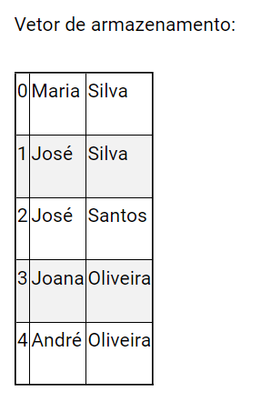

# Instructions

1. Construa uma função que solicite ao usuário a inserir nome e sobrenome e retorne em um vetor com duas posições e com as iniciais em maiúsculo.
2. Construa uma função que receba como entrada um endereço de email e retorne o valor booleano verdadeiro para o caso de um email válido ou falso para um endereço inválido. Para avaliar a validade, ele deverá ter a seguinte estrutura: nome@server.com , sendo que nome poderá ser qualquer estrutura composta apenas por letras, não sendo permitido o uso de caracteres especiais, enquanto que server.com poderá ser qualquer valor com estrutura separada por ponto.
3. Construa uma função que solicite um endereço de email e retorne esse valor apenas se o endereço for válido. Para o caso do valor informado ser inválido, deverá ser apresentada duas opções ao usuário: tentar novamente ou cancelar. Para o caso de cancelamento, a função deverá retornar o valor False.
4. Construa uma função que realize uma busca por nome ou sobrenome em um vetor de vetores de nomes que tenha a estrutura apresentada na questão 1. A função deve receber como passagem o vetor onde são armazenados os vetores de nome, o nome a ser buscado e uma opção de busca por sobrenome, cujo valor padrão seja sobrenome=False. O retorno deve ser um vetor contendo os índices de todas as posições onde os valores foram encontrados, conforme o exemplo:

7. Crie uma função que realize o cadastro do usuário, contendo o nome com sobrenome e email. A função receberá como parâmetro o vetor do banco de dados e devolve o vetor do banco de dados com o novo registro adicionado. Utilize a função desenvolvida na questão 1 para receber o nome e a função desenvolvida na questão 3 para receber o email.

8. Crie uma função que permita que o usuário realize uma pesquisa no banco de dados através do nome ou do sobrenome. A função deve solicitar ao usuário os parâmetros da busca e se ele é um nome ou sobrenome, e imprimir todos os valores encontrados.